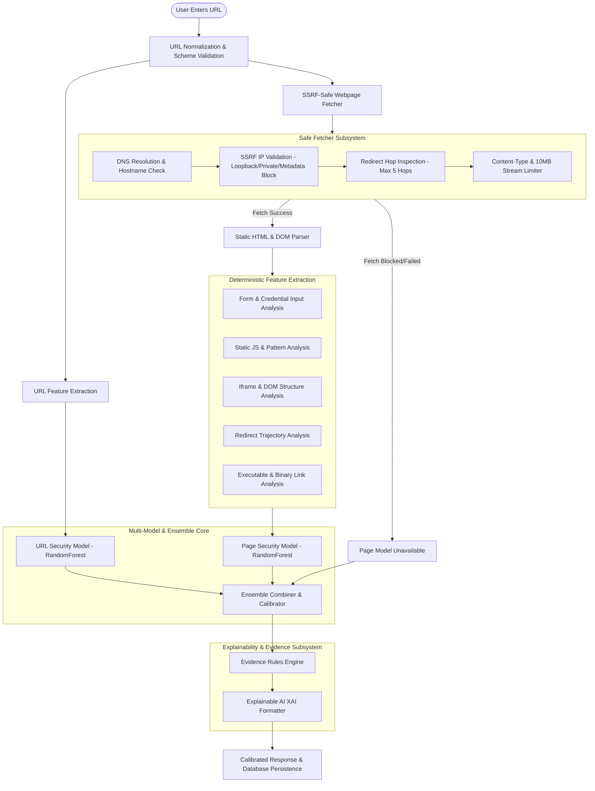

# 🛡️ ML-Based Website Security Assessment Architecture

## 1. Overview & Security Philosophy
The CyberShield AI **Website Security Assessment** module replaces generative AI heuristics for URL evaluation with a deterministic feature extraction and multi-model machine learning architecture.

> [!IMPORTANT]
> **Security Indicator Principle:**
> The system detects technical phishing and security-risk indicators (such as credential input fields, form domain mismatches, or suspicious redirects). It reports technical anomalies and risk indicators; it does **not** make unsupported claims about criminal intent.
> 
> **HTTPS Transport Disclaimer:**
> HTTPS TLS encryption guarantees confidentiality and integrity of traffic in transit; **HTTPS does not guarantee that a website is legitimate or trustworthy**.

---

## 2. End-to-End Analysis Architecture



---

## 3. Extracted Feature Pipeline

### 3.1 URL Features (37 Features)
- **Lexical Dimensions**: `url_length`, `hostname_length`, `path_length`, `query_length`, `fragment_length`.
- **Character Distributions & Special Characters**: `num_dots`, `num_hyphens`, `num_underscores`, `num_slashes`, `num_percent`, `num_at`, `num_double_slash_path`, `num_question_marks`, `num_equal_signs`, `num_ampersands`, `num_digits`, `num_special_chars`, `digit_ratio`, `special_char_ratio`.
- **Domain Hierarchy**: `subdomain_count`, `subdomain_length`, `base_domain`.
- **Statistical Entropies**: Shannon entropies of `url`, `hostname`, `path`, `query`.
- **Structural Anomalies**:
  - `is_ip_address`: Raw IPv4/IPv6 host detection.
  - `is_suspicious_port`: Non-standard HTTP/HTTPS ports.
  - `is_punycode`: Internationalized domain names (`xn--`) used for homograph attacks.
  - `is_https`: TLS encryption presence.
  - `has_at_symbol`: Authentication prefix disguise.
  - `excessive_percent_encoding`: Obfuscation threshold.
  - `is_shortened_url`: Detection against URL shortener networks.
  - `suspicious_tld_indicator`: High-abuse TLDs (`.top`, `.xyz`, `.click`, `.loan`, `.icu`, etc.).
  - `brand_in_subdomain_or_path`: High-target brand keywords appearing on third-party domains.

---

### 3.2 HTML, DOM & Form Features (43 Features)
- **General DOM**: `html_size`, `title_length`, `title_domain_similarity`, `visible_text_length`, `text_to_html_ratio`, `num_links`, `num_internal_links`, `num_external_links`, `external_link_ratio`, `empty_link_ratio`, `num_images`, `external_image_ratio`, `num_meta_tags`, `has_meta_refresh`.
- **Form Security & Credential Inputs**:
  - `has_password_field`, `num_password_fields`: Password inputs.
  - `has_email_field`, `has_username_field`: Account identity inputs.
  - `has_otp_field`, `num_otp_fields`: 2FA/MFA/OTP verification tokens.
  - `has_payment_field`, `has_cvv_field`, `has_pin_field`: Financial card numbers, CVVs, PINs.
  - `has_personal_info_field`: SSN, National ID, Aadhaar, DOB, Tax ID fields.
  - `num_hidden_inputs`, `num_submit_buttons`.
- **Form Action Destination Security**:
  - `has_external_form_submit`: Form resolves to a destination domain different from the page domain.
  - `has_empty_form_action`: Form action pointing to `#` or empty string.
  - `has_mailto_form_action`: Direct submission via email handler.
  - `has_insecure_form_action`: HTTPS page submitting unencrypted over HTTP.
  - `form_domain_mismatch_count`: Number of external form submission endpoints.

---

### 3.3 Static Script & Iframe Telemetry (18 Features)
- **JavaScript Static Signatures**:
  - `has_eval`: Dynamic string execution (`eval(...)`).
  - `has_function_constructor`: `new Function(...)` constructor invocation.
  - `has_document_write`: Unsafe DOM injection.
  - `has_event_tampering`: Right-click and context menu blocking (`oncontextmenu`, `preventDefault()`).
  - `has_base64_payload`: Base64 encoded payload strings inside script blocks.
  - `script_entropy`, `total_script_length`, `num_external_script_domains`.
- **Iframes**:
  - `num_iframes`, `num_external_iframes`, `has_hidden_iframe` (zero-dimension or hidden style iframes).

---

### 3.4 Redirect & Resource Downloads
- **Redirects**: `redirect_count`, `has_redirect`, `has_domain_change`, `has_https_downgrade`, `suspicious_redirect_pattern`.
- **Downloads**: `num_download_links`, `num_executable_downloads` (`.exe`, `.msi`, `.apk`, `.scr`, `.bat`, `.ps1`), `has_auto_download_tag`.

---

## 4. SSRF & Safe Webpage Fetcher

The Safe Webpage Fetcher (`ml/inference/safe_fetcher.py`) protects the server against Server-Side Request Forgery (SSRF) and Denial of Service (DoS):

1. **Protocol Restriction**: Only `http://` and `https://` schemes are permitted. Schemes such as `file://`, `javascript:`, `data:`, `gopher://` are rejected.
2. **DNS & IP Validation**: Resolves all target hostnames before opening connections.
3. **Disallowed IP Ranges**:
   - Loopback (`127.0.0.0/8`, `::1`)
   - Private Networks (`10.0.0.0/8`, `172.16.0.0/12`, `192.168.0.0/16`, `fc00::/7`)
   - Link-Local (`169.254.0.0/16`, `fe80::/10`)
   - Cloud Metadata (`169.254.169.254`, `100.100.100.200`, `fd00:ec2::254`)
   - Multicast & Unspecified addresses (`0.0.0.0`)
4. **Redirect Validation**: Every redirect hop re-validates the destination scheme and resolved IP address. Maximum 5 hops enforced.
5. **Payload Limiter**: Streams up to 10 MB maximum and enforces a strict 8-second timeout.

---

## 5. Model Architecture & Calibration

- **Model 1 (URL Model)**: Tree-based ensemble (`RandomForestClassifier` with balanced class weights) trained on URL lexical, entropy, and domain features.
- **Model 2 (Page Model)**: Tree-based classifier trained on HTML/DOM, form, script, iframe, and resource features.
- **Model 3 (Ensemble Model)**: Multi-modal aggregator weighting URL and Page probabilities with rule-based overrides for critical threat signals (e.g. credential fields submitting to external destination domains).
- **Probability Calibration**: Uses `CalibratedClassifierCV` (Isotonic regression) to output reliable probabilities where:
  \[
  P(\text{legitimate}) + P(\text{phishing}) = 1.0
  \]
- **Risk Bands**:
  - `0.0% – 20.0%`: **LOW**
  - `20.0% – 50.0%`: **MEDIUM**
  - `50.0% – 75.0%`: **HIGH**
  - `75.0% – 100.0%`: **CRITICAL**

---

## 6. Dataset Preparation & Training Commands

### Dataset Directory
Place the CompPhish Version 4 dataset in:
```
data/compPhish_v4/
```

### Dataset Inspection
```bash
python -m ml.dataset_inspector
```

### Training Pipeline Execution (After Dataset Download)
```bash
python -m ml.training.train_url_model
python -m ml.training.train_page_model
python -m ml.training.train_ensemble
python -m ml.training.evaluate
```

---

## 7. Explainability & Evidence Output
Every scan generates deterministic, evidence-based bullet points and Explainable AI Markdown:

```markdown
### 🛡️ Explainable AI (XAI) Assessment:
* **Estimated Classification**: LOW (Estimated Phishing Risk: 5.8%, Estimated Trusted Probability: 94.2%)
* **Model Assessment**: Normal structural patterns with high legitimacy confidence. Trusted probability evaluated at 94.2%.
* **Form & Data Inputs**: No credential collection or external form submissions detected.
* **Script & Structural Telemetry**: Clean DOM structure with no obfuscated scripts or hidden iframes.
* **Navigation & Redirects**: Direct connection with no redirect hops.
* **Security Disclaimer**: This assessment reflects observed technical security indicators and does not guarantee complete absence or presence of malicious activity.
```
